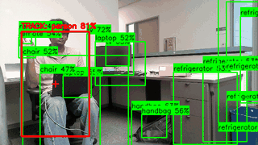

# Ventuno Object Tracking




A person-following robot demo built on a [TurtleBot 4](https://clearpathrobotics.com/turtlebot-4/), with the
stock Raspberry Pi replaced by an **Arduino Ventuno Q** board. It shows an end-to-end edge AI pipeline running entirely on-device on Qualcomm hardware:

- **OAK-D Lite** stereo camera streams RGB + depth over ROS 2
- **YOLOX-Tiny** detects objects on the Ventuno Q's Hexagon NPU via [ExecuTorch](https://github.com/pytorch/executorch)
  and Qualcomm's QNN runtime
- A simple tracker locks onto a target class (e.g. `person`, `bottle`, `chair`) and drives the TurtleBot 4's
  Create 3 base to follow it at a set distance, using stereo depth for range

Everything runs natively on the board, no internet required.

## Hardware

| Component | Role |
|---|---|
| Arduino Ventuno Q | Compute: Hexagon NPU, ARM CPU, replaces the TurtleBot 4's Raspberry Pi |
| Clearpath TurtleBot 4 Lite (Create 3 base) | Mobile base and sensor package |

## Software stack

- Ubuntu 24.04 (Qualcomm image) on the Ventuno Q
- ROS 2 Jazzy
- PyTorch ExecuTorch with the Qualcomm QNN HTP backend (NPU) or XNNPACK (CPU fallback)
- DepthAI for the OAK-D Lite

## Quickstart

On a fresh Ventuno Q (Ubuntu 24.04):

```bash
git clone https://github.com/TheOutcastVirus/ventuno-object-tracking.git ~/Documents/ventuno-object-tracking
cd ~/Documents/ventuno-object-tracking
bash scripts/install_ventuno_deps.sh
```

This installs ROS/system dependencies, the QAIRT/QNN SDK, builds ExecuTorch with the Qualcomm backend, sets up
the Create 3 USB-ethernet link, and builds the ROS workspace. See
[`.claude/skills/ventuno-setup/SKILL.md`](.claude/skills/ventuno-setup/SKILL.md) for what it does step by step,
how to debug a failed run, and how to replicate it manually on another board.

Run detection on the bundled sample images (no camera or robot required):

```bash
source /opt/ros/jazzy/setup.bash
source install/setup.bash
ros2 launch yolox_detector dataset_detector.launch.py backend:=npu
```

Run the full following demo on the robot:

```bash
ros2 launch object_tracking.launch.py
ros2 launch object_tracking.launch.py target_class:=bottle   # follow a different class
ros2 launch object_tracking.launch.py publish_cmd_vel:=false # dry run, no motion
```

## Repo layout

```
src/oak_camera/       ROS 2 driver for the OAK-D Lite (DepthAI)
src/yolox_detector/    YOLOX-Tiny detector node (CPU/XNNPACK or NPU/QNN backend)
src/object_tracker/    Depth-based following controller
tools/                 Model export scripts (PyTorch -> ONNX / ExecuTorch .pte)
models/                Pre-exported YOLOX-Tiny weights (.onnx, .pte)
docs/                  Setup guides and hardware bring-up notes
```

## Docs

Board setup and debugging knowledge lives in the `ventuno-setup` agent skill (plain markdown,
readable by any coding agent or human):

- [`.claude/skills/ventuno-setup/SKILL.md`](.claude/skills/ventuno-setup/SKILL.md) — overview,
  troubleshooting index, and end-to-end verification
- [`.claude/skills/ventuno-setup/references/executorch-qnn.md`](.claude/skills/ventuno-setup/references/executorch-qnn.md) —
  full ExecuTorch/QNN setup, from board identification to a running NPU detector
- [`.claude/skills/ventuno-setup/references/create3-connection.md`](.claude/skills/ventuno-setup/references/create3-connection.md) —
  wiring and bring-up for the Create 3 USB link
- [`.claude/skills/ventuno-setup/references/ros-networking.md`](.claude/skills/ventuno-setup/references/ros-networking.md) —
  DDS/network tuning notes

See also [`AGENTS.md`](AGENTS.md) for the Codex-compatible pointer to the same content.

## License

MIT — see [LICENSE](LICENSE).
